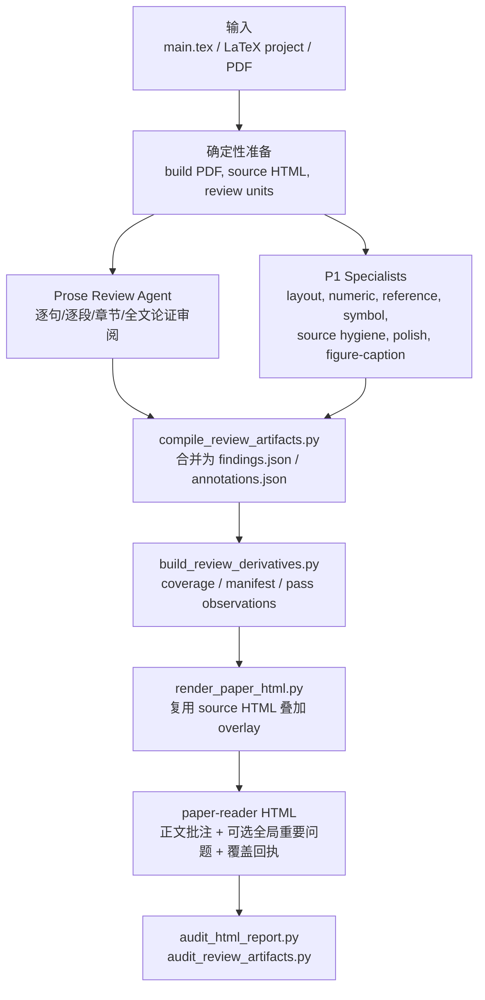

# Ariadne CS Paper Notes

Ariadne CS Paper Notes 是一个面向 CS/AI 论文草稿的 Codex / Claude skill。它把论文审阅拆成可复现的本地流水线：确定性脚本负责提取、渲染、编译、审计；LLM agent 只负责需要判断力的文字审阅，并输出结构化 JSON。

默认交付物是中文 `paper-reader` HTML：左侧保留论文原文，批注直接 overlay 到句子、段落、章节标题和少量全文结构位置上。`--full-report` 只会在 overlay 后额外追加真正不依附具体句段的全局重要问题，不再生成旧式冗长汇总表。

## 目标与定位

Ariadne 不是语法检查器，也不是自动改写器。它的目标是模拟资深导师和真实读者从第一页开始读论文时的卡顿、追问、反思和最终判断：

- 读者是否知道论文在解决什么问题，为什么这个问题值得做。
- central claim、gap、insight、method、evidence 和 limitation 是否连成一条可信的 argument。
- 每个 section、paragraph、sentence 是否完成自己的 job。
- 图表、caption、数字、引用、符号和 PDF 版式是否支撑正文叙事。
- 每条批注是否能落成下一稿作者可以自查的问题。

它不替作者发明实验结果、citation 或更强结论；只指出当前稿件在“读者理解”和“论文证据链”上的断点。

## 架构

核心原则很简单：**论文正文来自 source-derived HTML，LLM 只写 JSON，最终 HTML 由本地 renderer 确定性生成。**



### 三个角色

- **Coordinator**：`run_review_pipeline.py`。负责串起 source render、review unit extraction、specialists、prose packets、compile、derive、render 和 audit。它不手写 HTML，也不把 specialist-only 输出冒充全文文字审阅。
- **Prose Review Agent**：唯一阅读完整 `review_units` 的文字审阅者。Phase A 做线性深读，Phase B 读压缩后的 `phase_b_context.json` 和 specialist issues，做全文论证综合。
- **Specialists**：确定性或可选 LLM 支线审计。每条支线只看自己需要的 raw artifact，输出 curated `*_issues.json`，再由 compiler 统一转成 findings/annotations。

### 数据流

1. `main.tex` / PDF 进入本地准备阶段，生成 canonical `main.source.html` 和 `review_units.json`。
2. Prose agent 输出 prose issue shards；specialist scripts 输出 domain issue artifacts。
3. `compile_review_artifacts.py` 生成 `findings.json` 和 `annotations.json`。
4. `build_review_derivatives.py` 生成 `coverage.json`、`render_manifest.json`、`pass_observations.json`。
5. `render_paper_html.py --reuse-raw-html` 在同一个 source HTML 上加 overlay。
6. 两个 audit 脚本检查 HTML、JSON、source hash、coverage 和 anchor 是否一致。

## 常用工作流

### 完整流水线

```bash
python ariadne-cs-paper-notes/scripts/run_review_pipeline.py \
  path/to/main.tex \
  --bundle path/to/ariadne_notes_main_YYYYMMDD \
  --report-html path/to/ariadne_notes_main_YYYYMMDD/main.html \
  --prose-agent-cmd "your-agent-command" \
  --full-report
```

说明：

- 不传 `--full-report` 时只输出正文 overlay + coverage receipt。
- 传 `--full-report` 时只额外输出 `#global-findings`，用于 novelty、story logic、实验设计等真正全文级问题。
- Prose Phase A/B 未完成时，pipeline 会停在 checkpoint，不会把局部 artifacts 包装成完整全文审阅。
- `--allow-partial-compile` 只适合调试，不应当作为最终论文审阅交付。

### 只准备 source HTML 和 packets

```bash
python ariadne-cs-paper-notes/scripts/run_review_pipeline.py \
  path/to/main.tex \
  --bundle path/to/bundle \
  --prepare-only
```

### 从已有 artifacts 重新渲染 HTML

```bash
python ariadne-cs-paper-notes/scripts/render_paper_html.py \
  path/to/main.tex \
  --raw-html path/to/bundle/main.source.html \
  --reuse-raw-html \
  --annotations path/to/bundle/annotations.json \
  --findings path/to/bundle/findings.json \
  --issues-dir path/to/bundle/issue_artifacts \
  --coverage path/to/bundle/coverage.json \
  --full-report \
  --output path/to/bundle/main.html
```

### 审计最终产物

```bash
python ariadne-cs-paper-notes/scripts/audit_html_report.py \
  path/to/bundle/main.html \
  --source path/to/bundle/main.source.html

python ariadne-cs-paper-notes/scripts/audit_review_artifacts.py \
  --bundle path/to/bundle \
  --html path/to/bundle/main.html \
  --source path/to/bundle/main.source.html
```

## 产物说明

一个完整 bundle 通常包含：

```text
ariadne_notes_main_YYYYMMDD/
├── main.source.html              # 未加批注的 canonical paper-reader HTML
├── main.html                     # 最终 paper-reader overlay HTML
├── review_units.json             # prose agent 阅读的句子/段落/章节单元
├── findings.json                 # 批注教学内容的主数据
├── annotations.json              # anchor-only overlay 映射
├── coverage.json                 # 覆盖回执
├── render_manifest.json          # 渲染形状、source hash、完整性状态
├── pass_observations.json        # deterministic 派生的阶段观察
├── compiled_issue_index.json     # issue source 到 finding 的索引
├── issue_artifacts/              # specialist 输出
├── phase_a_*.json / phase_b_*    # prose checkpoint 与综合上下文
└── pipeline_status.json          # coordinator 状态
```

最终 HTML 的当前结构非常克制：

- `#paper-reader`：论文原文 overlay 批注。
- `#global-findings`：仅在 `--full-report` 下出现，只放独立全文级 Major/Blocker。
- `#coverage-receipt`：说明 source、hash、覆盖和 artifact 状态。

旧式 `issue-index`、`deep-reading-notes`、`submission-readiness` 等汇总区块不属于当前 paper-reader 输出。

## 代码结构

仓库外层是 Git repo，内层 `ariadne-cs-paper-notes/` 是可安装到 Codex / Claude 的 skill 包。

```text
.
├── README.md
├── LICENSE
├── LICENSE-DOCS
└── ariadne-cs-paper-notes/
    ├── SKILL.md
    ├── agents/
    │   └── openai.yaml
    ├── references/
    │   ├── workflow.md
    │   ├── report_contract.md
    │   ├── html_contract.md
    │   ├── numeric_contract.md
    │   └── review_lenses.md
    ├── scripts/
    │   ├── run_review_pipeline.py
    │   ├── build_paper_pdf.py
    │   ├── extract_paper_text.py
    │   ├── extract_review_units.py
    │   ├── run_p1_specialists.py
    │   ├── check_page_layout.py
    │   ├── check_figure_caption.py
    │   ├── check_references.py
    │   ├── check_source_hygiene.py
    │   ├── check_polish.py
    │   ├── check_symbol.py
    │   ├── build_specialist_issues.py
    │   ├── build_prose_phase_packet.py
    │   ├── build_prose_shards.py
    │   ├── phase_a_resume_status.py
    │   ├── run_prose_agent.py
    │   ├── run_specialist_agent.py
    │   ├── run_vision_figure_agent.py
    │   ├── run_agent_command.py
    │   ├── build_phase_b_input.py
    │   ├── compile_review_artifacts.py
    │   ├── build_review_derivatives.py
    │   ├── render_paper_html.py
    │   ├── audit_html_report.py
    │   ├── audit_review_artifacts.py
    │   └── calibrate_review_runs.py
    └── tests/
        ├── fixtures/
        └── test_*.py
```

### 关键文件

- `SKILL.md`：agent 入口说明，规定什么时候触发、如何调度 pipeline、哪些事情必须由本地脚本完成。
- `references/workflow.md`：端到端工作流、checkpoint、coverage 和 QA gates。
- `references/report_contract.md`：`findings.json`、`annotations.json`、coverage、manifest 等 artifact contract。
- `references/html_contract.md`：paper-reader HTML 结构、overlay 规则、source fidelity 和 audit 规则。
- `references/numeric_contract.md`：表格数字、reported/computed/delta 和 numeric issue 规则。
- `references/review_lenses.md`：导师式审阅镜头和写作原则。
- `scripts/run_review_pipeline.py`：顶层 coordinator。
- `scripts/render_paper_html.py`：最终 deterministic HTML renderer。
- `scripts/audit_html_report.py` / `scripts/audit_review_artifacts.py`：最终交付前的两道审计。

## 脚本分层

### 1. Source 与 review unit 准备

- `build_paper_pdf.py`：尝试从 LaTeX 项目编译 PDF。
- `extract_paper_text.py`：从 PDF/LaTeX 提取文本、表格和数值信号。
- `extract_review_units.py`：从 source-derived paper HTML 提取句子、段落、章节单元。

### 2. Specialist 支线

- `run_p1_specialists.py`：按输入可用性调度确定性 specialists。
- `check_page_layout.py`：PDF 页面和版式信号。
- `check_figure_caption.py`：figure/table/caption、引用和渲染 caption 信号。
- `check_references.py`：citation/reference 覆盖。
- `check_source_hygiene.py`：匿名性、TODO、camera-ready 等 source hygiene。
- `check_polish.py`：标点、空格、LaTeX polish。
- `check_symbol.py`：符号和宏漂移。
- `build_specialist_issues.py`：把 raw audit 转成统一 `*_issues.json`。

### 3. Prose agent 编排

- `build_prose_phase_packet.py`：为 prose agent 生成 Phase A/B packet。
- `build_prose_shards.py`：长论文 Phase A 分片。
- `phase_a_resume_status.py`：检查 Phase A 是否完整、下一步该读哪里。
- `run_prose_agent.py`：调用外部 prose agent，并维护 resume/checkpoint。
- `build_phase_b_input.py`：把 Phase A 和 specialists 压成 Phase B 上下文。

### 4. 合并、渲染、审计

- `compile_review_artifacts.py`：把 prose/specialist issues 编译成 `findings.json` 和 `annotations.json`。
- `build_review_derivatives.py`：派生 coverage、manifest 和 pass observations。
- `render_paper_html.py`：复用 canonical source HTML，叠加 overlay 批注。
- `audit_html_report.py`：检查 HTML 结构、anchor、link、source fidelity。
- `audit_review_artifacts.py`：检查 HTML 与 JSON bundle 是否一致。
- `calibrate_review_runs.py`：比较两次 review 的 finding drift。

### 5. 可插拔 agent adapters

- `run_agent_command.py`：provider-neutral packet-to-command adapter。
- `run_specialist_agent.py`：可选 LLM specialist refinement。
- `run_vision_figure_agent.py`：可选 vision-capable figure/caption specialist。

## 安装

### Codex skill installer

```bash
python ~/.codex/skills/.system/skill-installer/scripts/install-skill-from-github.py \
  --repo FeiSun/ariadne-cs-paper-notes \
  --path ariadne-cs-paper-notes
```

安装后重启 Codex。

### 手动安装到 Codex

```bash
git clone git@github.com:FeiSun/ariadne-cs-paper-notes.git
cd ariadne-cs-paper-notes

mkdir -p ~/.codex/skills
rsync -a \
  --exclude tests \
  --exclude __pycache__ \
  --exclude .pytest_cache \
  --exclude .claude \
  --exclude .gitignore \
  ariadne-cs-paper-notes/ \
  ~/.codex/skills/ariadne-cs-paper-notes/
```

### 手动安装到 Claude Code

```bash
mkdir -p ~/.claude/skills
rsync -a \
  --exclude agents \
  --exclude tests \
  --exclude __pycache__ \
  --exclude .pytest_cache \
  --exclude .claude \
  --exclude .gitignore \
  ariadne-cs-paper-notes/ \
  ~/.claude/skills/ariadne-cs-paper-notes/
```

`agents/openai.yaml` 是 Codex UI metadata，Claude Code 不需要。

## 依赖

必需：

- Codex、Claude Code，或其他支持 local skills 的 agent runtime
- Python 3.9+，推荐 Python 3.10+

可选但推荐：

- `pandoc`：LaTeX 到 HTML/text 的主要路径。
- Poppler：`pdftotext`、`pdfinfo`、`pdftoppm`。
- `pdfplumber` 或 `pypdf`：PDF fallback。
- `latexmk` 或 `pdflatex`：从 LaTeX 编译 PDF。
- `bibtex` 或 `biber`：bibliography 支持。

缺少可选工具时会 graceful degrade，但 source fidelity、PDF layout 或 figure asset 检查会变弱。

## 使用提示

推荐用户请求：

```text
审阅 ./path/to/main.tex 全文。
请使用 source-derived paper-reader HTML overlay 批注模式，输出中文 HTML。
按 Ariadne 导师级审阅逻辑，逐句、逐段、逐章检查，不抽样，不只列 top issues。
```

如果只想准备 artifacts：

```text
为 ./path/to/main.tex 运行 Ariadne deterministic prep，生成 source HTML、review units 和 specialist issue artifacts，先不要冒充完整全文审阅。
```

如果想要额外全局意见：

```text
在 paper-reader overlay 后额外附上真正全文级的 Major/Blocker 全局重要问题，例如 novelty、故事逻辑、实验设计或可信度链条，不要生成旧式问题索引表。
```

## 开发与检查

从仓库根目录运行：

```bash
python -m pytest ariadne-cs-paper-notes/tests
```

常用轻量检查：

```bash
python -m py_compile ariadne-cs-paper-notes/scripts/*.py
python ariadne-cs-paper-notes/tests/test_render_paper_html.py
python ariadne-cs-paper-notes/tests/test_run_review_pipeline.py
```

## 安全与隐私

这个工具按“可信输入”设计，主要用于审阅你自己的 LaTeX/PDF 草稿。不要直接把陌生 LaTeX 项目当可信代码编译。

生成 artifacts 可能包含 manuscript text、作者名、affiliation、email、ORCID、GitHub link、acknowledgment、绝对路径、匿名性信号和审稿判断。不要把 `ariadne_notes_*.html`、bundle、编译 PDF 或论文源文件提交到公开仓库，除非这些内容本来就准备公开。

## License

辅助脚本和测试使用 Apache License 2.0，见 `LICENSE`。

skill 指令、prompt、reference checklist、HTML report guidance、README 和其他非代码说明材料使用 CC BY-SA 4.0，见 `LICENSE-DOCS`。
